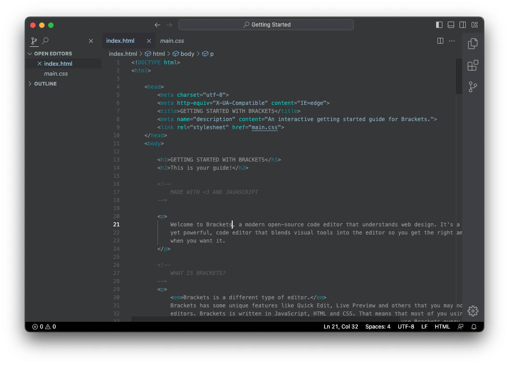
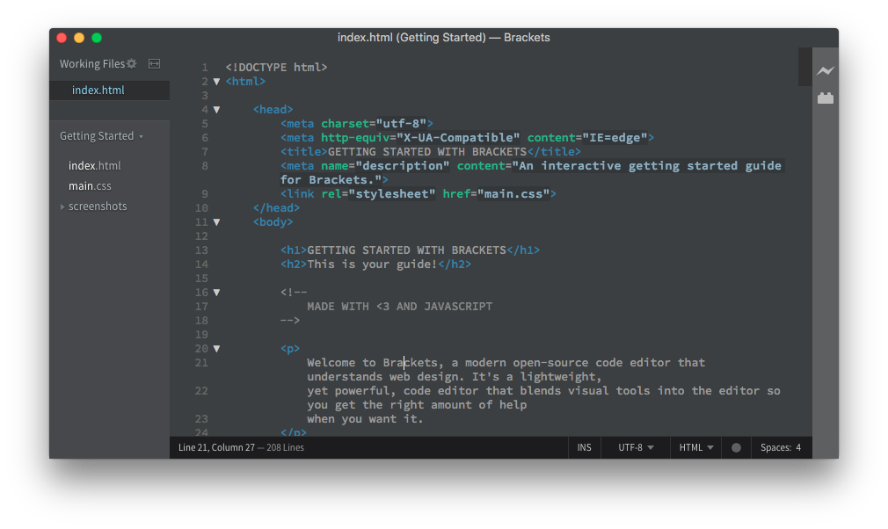

<h1 align="center">
   
    
   
   
    Minimal Dark
   
   
</h1>

<h4 align="center">A sophisticated and minimalist dark theme for Visual Studio Code</h4>

  
  
  
  

Minimal Dark returns with a complete redesign for Visual Studio Code, building upon the success of its predecessor that achieved over 20k downloads. This theme emphasizes readability, consistency, and visual hierarchy while maintaining the clean, minimalist aesthetic developers love.

### Key Features

- **Optimized Color Palette**: Carefully selected colors that reduce eye fatigue during long coding sessions
- **Enhanced Syntax Highlighting**: Improved contrast and distinction between different code elements
- **Consistent UI Integration**: Seamlessly integrated with VSCode's interface for a cohesive experience
- **Multi-Language Support**: Optimized for JavaScript, TypeScript, Python, HTML, CSS, and more

  
  
<em>Minimal Dark for Visual Studio Code</em>

## Installation

1. Open **Visual Studio Code**
2. Go to the **Extensions** view (`Ctrl+Shift+X` or `Cmd+Shift+X`)
3. Search for "**Minimal Dark**"
4. Click **Install** on the theme by **ArturGuedx**
5. Open **Command Palette** (`Ctrl+Shift+P` or `Cmd+Shift+P`)
6. Type "**Color Theme**" and select "**Preferences: Color Theme**"
7. Choose "**Minimal Dark**" from the list

You can also install Minimal Dark via the Visual Studio Code Marketplace:

1. Go to the [Visual Studio Code Marketplace](https://marketplace.visualstudio.com/items?itemName=ArturGuedx.minimaldark)
2. Click **Install**
3. Restart Visual Studio Code
4. Select the theme from the Color Theme menu

## Supported Languages

Minimal Dark provides enhanced syntax highlighting for:

- JavaScript / TypeScript
- Python
- HTML / CSS / SCSS
- JSON / YAML
- Markdown
- PHP
- And many more...

## Legacy: Brackets Version

> **Note**: The Brackets version of Minimal Dark has been archived as of June 2022. No further updates will be provided for this version.

  
  
<em>Minimal Dark for Brackets (Legacy Version)</em>

For historical information about the Brackets version, see the [Brackets README](/brackets/README.md).

## What's new?

For a detailed list of changes and updates, see our [Changelog](CHANGELOG.md).

## License

This project is licensed under the [GNU General Public License v3.0](LICENSE).

---

  
  If you find this theme helpful, please consider giving it a star on GitHub and leaving a review on the VSCode Marketplace.

