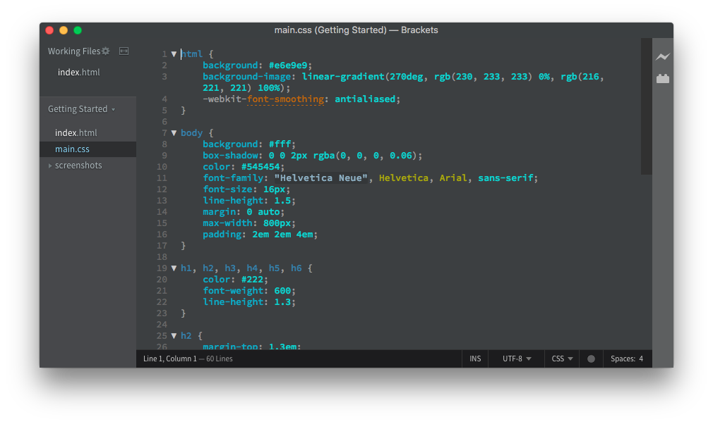
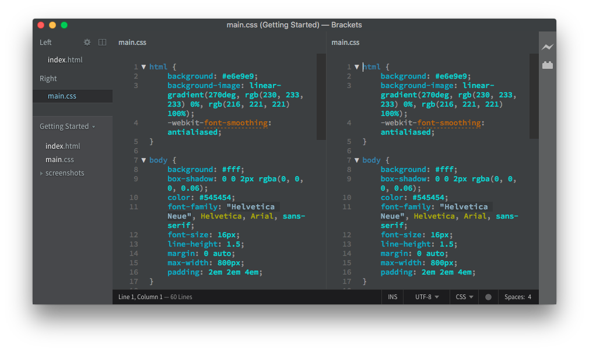

# Minimal Dark
_A sophisticated and minimalist theme for Brackets. Perfectly balanced with carefully selected colors to please your eyes without disturbing your productivity._

__Thanks for the 25k+ downloads, see you next time 💙__

### Sumary
- [Getting Started](#getting-started)
    - [Prerequisites](#prerequisites)
    - [Installing](#installing)
        - [Install using Extension Manager](#install-using-extension-manager)
        - [Install from URL](#install-from-url)
        - [Install from file system](#install-from-file-system)
- [Screenshots](#screenshots)
- [Change History](#change-history)
- [License](#license)

## Getting Started

### Prerequisites
Themes for Brackets can only be used from version 1.0 and later, so make sure your version is updated or download at: [Brackets.io](http://brackets.io/)

### Installing
You may download and install this theme in one of three ways. 

#### Install using Extension Manager
- Open the Extension Manager from the File menu.
- Click in Themes tab on upper left corner.
- Find *Minimal Dark*.
- Click Install.

#### Install from URL
- Open the Extension Manager from the File menu.
- Click on *Install from URL...*
- Copy and paste following URL in the text field: `https://github.com/ArturGuedes/MinimalDark`
- Click Install.

#### Install from file system
- [Download](https://github.com/ArturGuedes/MinimalDark/archive/master.zip) this extension and unzip it.
- Copy it in Brackets `~/extensions/user` folder by selecting Show Extension Folder in the Help menu.
- Reload Brackets.

## Installation

Download Brackets on: [Brackets.io](http://brackets.io/)

You may download and install this extension in one of three ways. 

### Install using Extension Manager
- Open the Extension Manager from the File menu.
- Click in Themes tab on upper left corner.
- Find *Minimal Dark*.
- Click Install.

### Install from URL
- Open the Extension Manager from the File menu.
- Click on *Install from URL...*
- Copy and paste following URL in the text field: `https://github.com/ArturGuedes/MinimalDark`
- Click Install.

### Install from file system
- [Download the latest version](https://github.com/ArturGuedes/MinimalDark/releases) of this extension and unzip it.
- Copy it in Brackets `~/extensions/user` folder by selecting Show Extension Folder in the Help menu.
- Reload Brackets.

## Screenshots

### HTML

### CSS

### Vertical Split

### Change History
* 11/15/2018
    * Support for PHP files
    * Restructuring the code
    * Description translated to Portuguese (BR)
* 12/11/2018
    * Release version 2.0.0! :tada:
    * New color palette
    * Animation in the selection of code block
    * Reorganized and commented code
    * Fixed issues
* 10/26/2017
    * Change in some colors
* 07/07/2017
    * Changes to publisher title when the screen is split
    * New scrollbar style
    * Fixed issues
* 08/16/2017:
    * Initial code

## License

This project is licensed under the GNU General Public License v3.0. Read [LICENSE](LICENSE) for further information.

